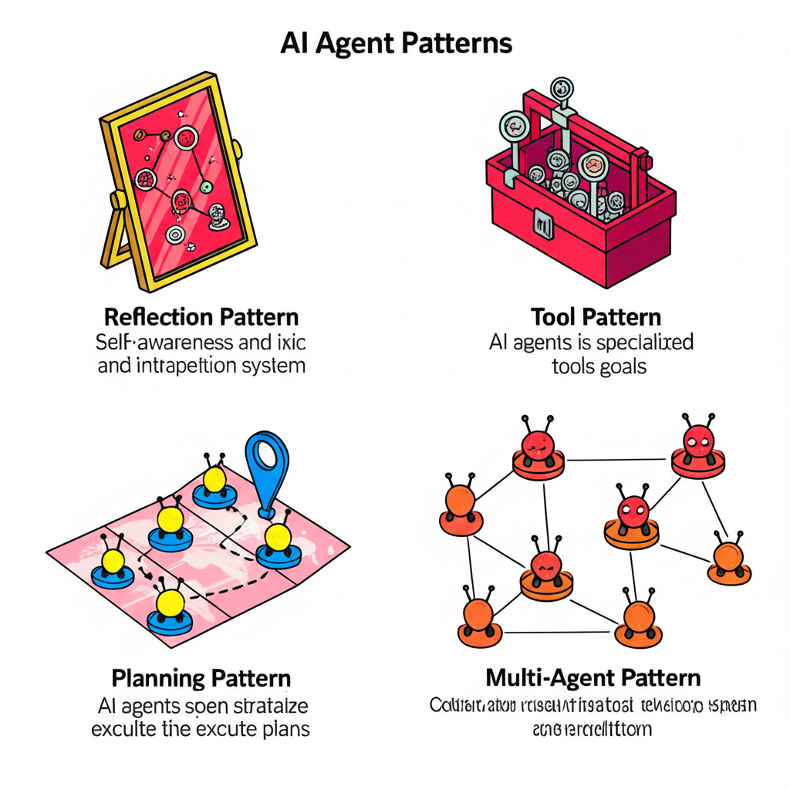

<p align="center">
    
    <h1 align="center">Agentic Patterns</h1>
    <h3 align="center">This repository contains an implementation of the 4 agentic patterns as defined by Andrew Ng in his DeepLearning.AI blog article series.</h3>
</p>

A modular TypeScript framework for building AI agents using advanced **Agentic Design Patterns** including:

- 🔁 Reflection
- 🔧 Tool Use
- 🧭 Planning
- 🤝 Multi-Agent Collaboration

Powered by [OpenAI](https://platform.openai.com) and designed for extensibility, clarity, and production-readiness.

---

## 📦 Tech Stack

- **TypeScript**
- **OpenAI API**
- **Node.js (npm)**
- **dotenv** for environment configuration

---

## 📁 Project Structure

```
ai-agentic-pattern/
├── src/
│   ├── agents/                # Specialized agents (Planner, Executor, Reflector, etc.)
│   ├── core/                  # Interfaces, types, context/memory abstractions
│   ├── tools/                 # Tool definitions and implementations
│   ├── llm/                   # OpenAI integration
│   ├── workflows/             # Orchestration logic
│   ├── config/                # Constants and env loaders
│   └── index.ts               # Main entry point
├── .env                       # Environment variables
├── package.json
├── tsconfig.json
└── README.md
```

---

## 🚀 Getting Started

### 1. Clone the Repository

```bash
git clone https://github.com/abhishekbansal012/ai-agentic-patterns.git
cd ai-agentic-pattern
```

### 2. Install Dependencies

```bash
npm install
```

### 3. Set Up Environment Variables

Create a `.env` file in the project root with your OpenAI API key:

```bash
OPENAI_API_KEY=your_openai_key_here
```

### 4. Run the Application

```bash
npm start
```

This will execute the sample workflow defined in `src/index.ts`.

---

## 🧠 Supported Agent Patterns

| Pattern        | Description                                                |
|----------------|------------------------------------------------------------|
| **Reflection** | Evaluates outputs and suggests improvements                |
| **Tool Use**   | Calls external tools like web search, calculator, etc.     |
| **Planning**   | Breaks down user goals into step-by-step actions           |
| **Multi-Agent**| Coordinates multiple agents for collaborative tasks        |

---

## 🧩 Extending the Framework

You can add new agents or tools by implementing the base interfaces:

```ts
// Agent Interface
export interface Agent {
  name: string;
  role: string;
  run(input: string): Promise<string>;
}

// Tool Interface
export interface Tool {
  name: string;
  description: string;
  run(input: string): Promise<string>;
}
```

Drop new implementations into `src/agents/` or `src/tools/`, and plug them into `src/workflows/taskRunner.ts`.

---

## 📚 Example Use Case

Input:
> "Research top 3 green energy policies globally and summarize them."

Workflow:
- `PlannerAgent` decomposes task.
- `ExecutorAgent` fetches responses from OpenAI.
- `ReflectorAgent` critiques/improves results.
- `CoordinatorAgent` manages the flow.

---

## 🔒 Environment Variables

| Variable         | Description               |
|------------------|---------------------------|
| `OPENAI_API_KEY` | Your OpenAI API key       |

Use `.env` and load it via `dotenv` in your codebase.

---

## 🛠 Future Enhancements

- [ ] Vector-based memory integration
- [ ] Web search agent with live data
- [ ] Persistent task history
- [ ] Logging, tracing and observability support
- [ ] Plug-and-play external agent plugins

---

## 📜 License

This project is licensed under the **MIT License**.

---

## 🤝 Contributions Welcome

Feel free to fork, improve, and PR! Let's build intelligent, modular AI agents together.

---


